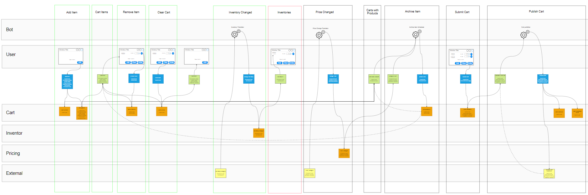

# Understanding Eventsourcing

A C# implementation of the examples from the book: [**Understanding Eventsourcing** - Planning and Implementing scalable Systems with Eventmodeling and Eventsourcing](https://leanpub.com/eventmodeling-and-eventsourcing).
The original code examples can be found here: [Github Examples](https://github.com/dilgerma/eventsourcing-book)

While I was playing around trying to implement my own event store just for fun and learning, Martin Dilgers released his book about Eventsourcing and Eventmodeling. Going through the book I found that I was actually aligned in many of my idears and concepts. So to test my event store I decided to try implement all the examples from the book. During the implementation minor changes and new concepts was needed which was a fun extra challange. But by now almost all the examples from the book can be handled nicely. Compared to the original Kotlin/Axon examples I have tried to use as little magic as possible making it very clear what is going on. The hope is that this repository can help demystify eventsourcing and prove that is is not really that complex after all.

To run the project, start by running docker-compose.

The actual implementation is located in the Cart and Cart.Tests folders.

In the Doc folder a [draw.io](https://www.drawio.com/) Event Modeling diagram can be found.

## A few words on Event Modeling

The Event Model shows the full flow. The model maps very easy to the code so it makes implementation very easy. Afterwards you have a nice document that clearly shows how the system is supposed to work. My main concern is the same as for all other diagrams. You can easily spend way too much time on things like making items snap and align correct or ensure you are on the correct layer. But it might just be a tooling issue, in my case draw.io.

Event Modeling consists of 4 patterns that is repeated again and again:
- Command pattrn - system receives a command and generates event(s)
- View pattern - based on the systems events a read model is created
- Translator pattern - external events are translated into a command
- Automation pattern - state change automatically causes a new command

I have marked each slice with a box to show it's scope. The box can be colored indicating the state of the slice. In this case: geen = done, red = in progress, black = to do.

## Implementing the slices

### Add item

Simple command pattern. System receives a "Add Item" command and creates "Cart Created" and "Item Added" events.

When looking into the code you will notice that in fact the "Item Added" has version 2. This is to show how to handle versioning. Ignore for now and see the section below about versioning.

### Get cart items

Simple view pattern. The read model is based on most of the cart events. As the cart will only have a few events it is totally legal to build the read model on run time. This way we will have full consistency and don't have to handle eventually consistency.

### Remove item

Simple command pattern.

### Clear cart

Simple command pattern.

### Inventory changed

Translator pattern. The system will receive an external event from Kafka and turn it into a command, which will generate an event.
As we only have the cart context implemented the external context is emulated using a http endpoint. The endpoint will publish the external event to Kafka. The translator will receive the event from Kafka and create the command.

### Inventories

We can have many products and the inventory can change all the time, thus potentially we can have many events. So we use a persisted read model. I have implemented it using raw sql, but it could just as well be done using e.g.EntityFramework or a document store or something else.
When we have persisted read models we can choose to build the model sync or async with the event beeing stored in the event store. We should generally avoid building the read models in sync as that will effect the performance of the command generating the event. But it comes with the cost of eventual consistency. In this case the event is originating from another context thus another flow. This means that eventual consistency is no problem at all.

### Price changed

Same as with **Inventory changed**. An external context is emulated with a http endpoint. The endpoint will publish the external event to Kafka. The translator will receive the event from Kafka and create the command.

### Carts with products

Another persisted read model. Again I have implemented it using raw sql but could be any other persistance method.
Notice that I think there is a mistake in the book, as the ItemId is suddenly used as the ProductId!

### Archive item

Automation pattern. The "Changed Prices" read model is in this case just on the model to make it understandable to the business. In fact the actual trigger is the event "Price Changed". The event will trigger the automation which will look in the "Carts with products" read model and for each cart with the given product execute a command.

### Submit cart

Simple command pattern.

### Publish cart

Another automation. It is triggered by the "Cart Submitted" event. It will execute a command to publish an external event to Kafka. Based on the result it will generate a new domain event with the result.

## Extra

### Versioning of events

### GDPR

### Uniqueness

### Avoid long event streams

### TODO pattern

## Conclusion

I think my event store can handle most relevant cases but there are still some that most be investigated futher and implemented to make it fully useful. So luckily there is still a lot to learn :-)

